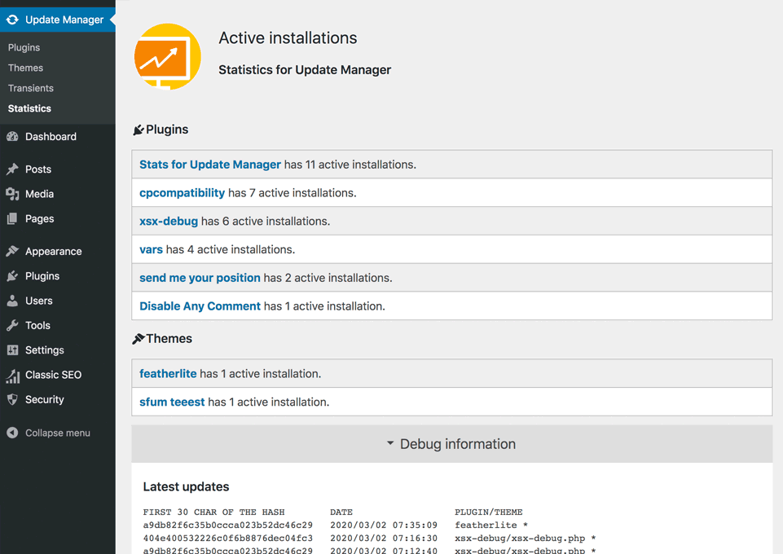

# Stats for Update Manager

This is a companion plugin for [**Update Manager**](https://codepotent.com/classicpress/plugins/) from [CodePotent](https://codepotent.com/).

With Stats for Update Manager you can count active installations of your plugins that serve updates with Update Manager.

You'll find a new submenu, *Statistics*, under the *Update Manager* menu.

It supports WP-CLI (see the help typing `wp help statistics`).

## When a plugin is in that count

Plugins that queried Update Manager at least once in the last week are considered active.  When a plugin have not queried Update Manager in the last 4 week it's removed from the database table. See [filters](#filters) section to tweak.

It also add the number of active installations in the plugin details. See [filters](#filters) section to tweak.

## Disclaimers
This plugin is intended to be used by *developers*.

## <a name="filters"></a>Filters
### Change/hide the number of active installations in plugin info tab
**`sfum_active_installations`** let's you change/hide the number displayed in the details of your plugins.

Examples:

`add_filter('sfum_active_installations', 'example_filter');`

Don't show active installation for my nothing-to-see plugin and raise it to one million for boost!

```php
	function example_filter($ar){
		unset ($ar['nothing-to-see/nothing-to-see.php']);
		$ar['boost/boost.php'] = 1000000;
		return $ar;
	}
```

Or simply disable it all

```php
	function example_filter($ar){
		return [];
	}
```

Note: the real number is cached for 6 hours.

### Recognize your own sites in debug
**`sfum_my_sites`** let's you recognize your own sites. They will be marked with an * in the debug informations.
With this filter you can populate an array of sha512-hashed urls.
Example:

```php
add_filter('sfum_my_sites', 'all_my_sites');

function all_my_sites($sha) {
	$mysites = [
		'https://my-first-site.dog',
		'https://www.my-second-site.dog'
		];
	
	$myhashes = array_map(function($value){
		return hash('sha512', $value);
	}, $mysites);
	
	return $myhashes;
}
```
### Configure the timing a plugin is considered active or stale
**`sfum_inactive_after`** let's you configure the number of days before a plugin installations is considered inactive.

**`sfum_old_after`** let's you configure the number of days before a plugin installations is considered stale and will be removed from the database.

Example:

```php
// An entry is old after 2 days and will be removed after 7
add_filter('sfum_inactive_after', 'return_two');
add_filter('sfum_old_after', 'return_seven');

function return_two($days) {
	return 2;
}
function return_seven($days) {
	return 7;
}

```
*Note that filtering `sfum_old_after` to 0 will erase your database when the daily maintenence cronjob is executed.*

## Shortcodes 

### [sfum-installs]

The above shortcode returns an integer depicting the total number of all installations (of all plugins) across the web. Developers can use it in a sentence:
> Our plugins have [_n_] active installations!

### [sfum-installs id="my-plugin-folder/my-plugin-file.php"]

Building on the previous example, you can also provide a plugin id. This shortcode returns an integer depicting the total number of installs for the plugin with the given `identifier`. Developers can use it in a sentence:
> My Awesome Plugin has [_n_] active installations!

### [sfum-domains]

This shortcode returns an integer depicting the number of unique domains using all of the developer's plugins. Developers can use it in a sentence: 

> Code Potent is running on [_n_] sites!

### GDPR / privacy

This plugin stores data about plugin updates in a table. 
You can configure how much time this data is kept using `sfum_old_after` filter (defaults to 4 weeks).
All the data is removed at plugin uninstall.

- URL of the site asking for updates, sha512 hashed
- plugin checked
- timestamp of the last check

**Is up to you to decide if and to inform your plugin users that this data is kept.**

*This plugin itself is sending such information to the developer to keep statistical usage information.*

## Screenshot

